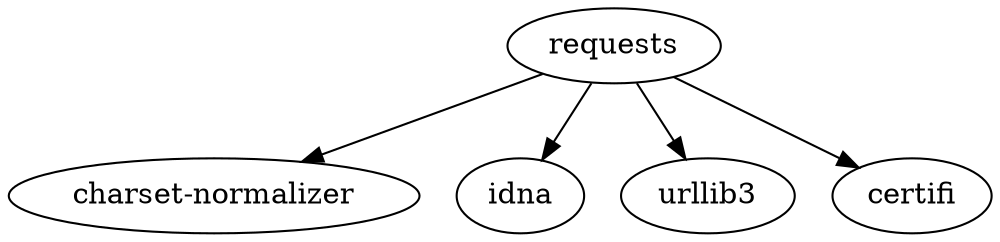
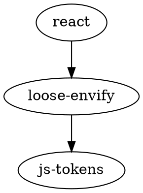
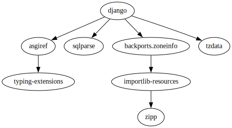
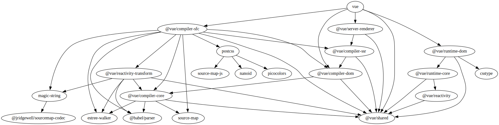

# Depviz

**Depviz** – a command line utility for visualizing dependency graph of package from npm or pip.

## Flags

**Depviz** supports these flags:

- `-pip [package_name]` – specify pip package
- `-npm [package_name]` – specify npm package

## Usage

**Depviz** prints into stdout dependency using .dot format.
You can use graphviz to convert it to appreciated format.

```shell
# Prints to stdout dependency graph of python package requests
depviz -pip requests
```

Here is the output:



```shell
# Prints dependencies of react
depviz -npm react
```

Output:



You can write output of the depviz to file:

```shell
depviz -pip requests > out.dot
```

Or provide its output directly to the input of `dot` command like this:

```shell
depviz -pip django | dot -Tsvg > out.svg
```

This command saves dependency graph of django package to out.svg:


Another example with npm:

```shell
depviz -pip vue | dot -Tsvg > out.svg
```

After execution of the command this graph will be created:


## Building

First of all clone the repository:

```shell
git clone https://github.com/burenotti/depviz
```

Then you have to options:

1. Build natively
2. Build docker image

### Building natively

Run `make build` to build depviz for all platforms.

### Building docker image

Run `make docker-build` to build image `burenotti/depviz`

Then you can run it like this:

```shell
docker run -it --rm burenotti/depviz [here is options...]
```
